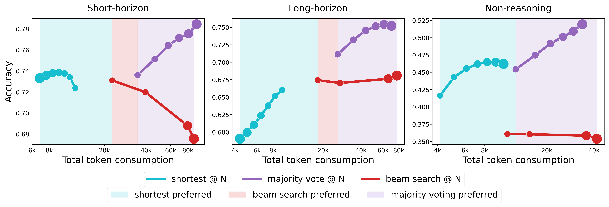

# The Art of Scaling Test-Time Compute for Large Language Models



## Overview

Welcome to the official implementation for the paper **The Art of Scaling Test-Time Compute for Large Language Models**. This repository provides the full code and data used in our large-scale study of test-time scaling (TTS) across:

- 8 large language models (7B to 235B parameters)  
- 4 reasoning datasets  
- 30B+ generated tokens  
- Three families of TTS strategies:
  - First Finish Search (FFS-k@N)
  - Last Finish Search (LFS-k@N)
  - Beam Search (BS@N)

We generate 8 parallel traces per model per problem and analyze accuracy, reasoning horizon, token usage, and compute scaling behavior across models and datasets.

# Repository Structure

```
.
├── generation/
│   ├── generate.py            # DeepInfra API based generation
│   ├── generate_local.py      # HF generate for DAPO-Qwen-32B
│   ├── config.yml            
│   ├── start_strings.txt      # Prefixes for diversification of traces
│
├── results/
│   ├── bs/                    # Beam search results
│   ├── vanilla/               # Vanilla (MV, FFS, LFS)
│   │   ├── Deepseek/
│   │   ├── GPT-OSS-120B/
│   │   ├── Qwen3/
│   │   ├── Qwen3-235B/
│   │   ├── QwQ/
│   │   ├── R1/
│   │   ├── R1DistilQwen/
│   │   ├── Dapo-Qwen-32B/     # Only here, not in bs/
│   │   └── ...
│   │        └── aime2024/
│   │        └── aime2025-i/
│   │        └── aime2025-ii/
│   │        └── gpqa/
│   │             └── {problem_id}_{sample_id}.json
│
├── analysis/
│   ├── difficulty/
│   ├── method_wise_analysis/
│   ├── tables/
│   ├── teaser/
│   └── tts_methods.pdf
│
├── sanity_checks/
│   ├── problem_match.py
│   ├── think_end_tag.py
│
├── dataset.py
├── GLOBALS.py
└── README.md

````

# Models

We evaluate 8 models. In our paper, we categorize these models as:

### Short-horizon models
- DeepSeek-R1  
- R1-Distill-Qwen (R1-32B)  
- QwQ-32B  
- DAPO-Qwen-32B (local inference only)

### Long-horizon models
- GPT-OSS-120B  
- Qwen3-32B

### Non-reasoning models
- Qwen3-235B-Instruct  
- DeepSeek-Chat

All models except DAPO-Qwen-32B are accessed via the DeepInfra API.

# Datasets

We evaluate four reasoning datasets.

### AIME (American Invitational Mathematics Examination)
- AIME 2024  
- AIME 2025-I  
- AIME 2025-II  
Short-answer math contest problems with integer answers between 000 and 999.

### GPQA Diamond
Graduate-level conceptual reasoning in physics, chemistry, and biology.  
Multiple choice with answers in {A, B, C, D}.

All traces are required to end with a final answer inside `\boxed{...}`.

# Trace File Format

Each trace stored in `results/.../*.json` has the following structure:

```json
{
  "problem": "raw problem string",
  "answer": "ground truth answer",
  "pred": "model prediction or NO_ANSWER",
  "completion_tokens": 1234,
  "trace": "full generated chain of thought"
}
````

Notes:

* `pred = "NO_ANSWER"` if no valid `\boxed{}` expression is found or parsing fails.
* `completion_tokens` uses the model-specific tokenizer.

# Generating Data

## 1. API-based generation (7 models)

```bash
cd generation
python generate.py \
    --models Qwen3-32B \
    --datasets aime2024 \
    --decode_method vanilla \
    --bucket_size 200
```

This script:

* Adds seeding prefixes from `start_strings.txt`
* Queries DeepInfra
* Writes outputs to `results/vanilla/<MODEL>/<DATASET>/`

## 2. Local generation (DAPO-Qwen-32B)

```bash
python generation/generate_local.py \
    --model dapo-qwen-32b \
    --dataset gpqa \
    --decode_method vanilla \
    --max_tokens 10000
```

# Sanity Checks

Run these before analysis to confirm correctness.

```bash
cd sanity_checks
python3 problem_match.py
python3 think_end_tag.py
```

# Reproducing All Results From the Paper

All plots, tables, horizon analyses, and token-accuracy curves can be reproduced using:

```bash
cd analysis/
python method_wise_analysis_per_model.py
python combined_models_plots.py
python difficulty_analysis.py
```

Outputs are written to `analysis/out/`.

The scripts reproduce:

* Length-quality correlation
* Beam search compute scaling
* FFS and LFS sweeps across k and N
* Horizon categorization
* All appendix plots

# Results Directory Structure

### Vanilla, MV, FFS, LFS outputs

```
results/vanilla/<MODEL>/<DATASET>/*.json
```

### Beam search (beam sizes 2 to 8)

```
results/bs/<MODEL>/<DATASET>/<BEAM_SIZE>/*.json
```

### Naming convention

```
{problem_id}_{sample_id}.json
```

* `problem_id` is the index inside the dataset
* `sample_id` corresponds to the seeding prefix in `start_strings.txt`

# Test-Time Scaling Strategies Implemented

### First Finish Search (FFS-k@N)

* Sample N traces
* Stop when k traces finish
* Vote among the k shortest traces

### Last Finish Search (LFS-k@N)

* Sample N traces
* Sort by trace length
* Vote among the k longest traces

### Beam Search (BS@N)

Standard left-to-right beam search.

# Installation

```bash
pip install -r requirements.txt
```

You must export your DeepInfra API key:

```bash
export API_KEY="your_deepinfra_api_key"
```

<!-- # Citation -->

<!-- ```
@article{agarwal2025arttts,
  title={The Art of Scaling Test-Time Compute for Large Language Models},
  author={Agarwal, Aradhye and Sengupta, Ayan and Chakraborty, Tanmoy},
  year={2025}
} -->
<!-- ``` -->

# Contact

For questions, please contact:
**[aradhye.agarwal@gmail.com](mailto:aradhye.agarwal@gmail.com)**
